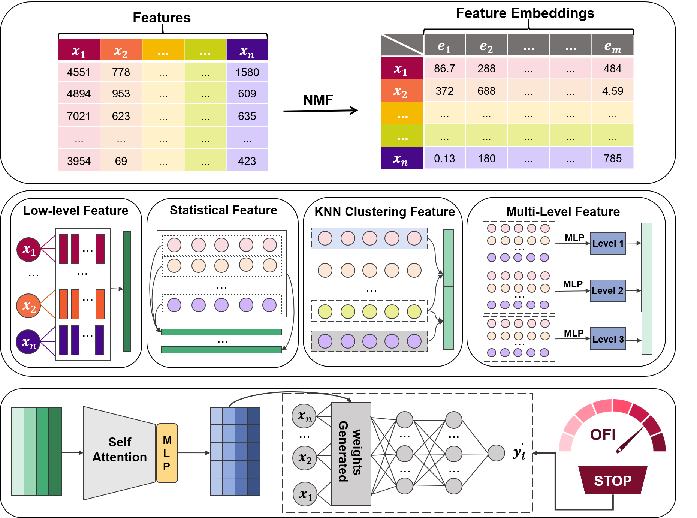

# GINet-OFI: A Global Interaction and Overfitting-aware Neural Network Framework for Small High-dimensional Tabular Data

## Overview

High-dimensional tabular data with limited samples are common in biomedicine, physics, and chemistry. However, the coexistence of sample scarcity and feature redundancy often causes serious overfitting, unstable training, and limited generalization. To address these issues, this paper presents a neural network framework, termed GINet-OFI (Global Interaction and Overfitting-aware Network), specifically designed for high-dimensional small-sample tabular learning. The proposed framework introduces a global interaction module to capture high-order dependencies among features, thereby enhancing the structural consistency of feature representations. In addition, an Overfitting Index (OFI) is developed to dynamically assess the generalization state during training and adaptively regulate model complexity. GINet-OFI further incorporates data-dependent weight initialization and dynamic capacity control, ensuring stable convergence and efficient inference without pretraining. Extensive experiments conducted on eight real-world tabular datasets show that GINet-OFI consistently outperforms several state-of-the-art baselines in both balanced accuracy and convergence stability. The results verify its superior generalization capability and robustness in high-dimensional small-sample scenarios. Overall, this study provides a structured and interpretable framework to mitigate overfitting and instability in tabular data modeling, offering a promising approach for stable and efficient knowledge-based learning systems.

## Framework Architecture




## Installation

```bash
git clone <repository-url>
cd GINet-OFI
pip install -r requirements.txt
```
